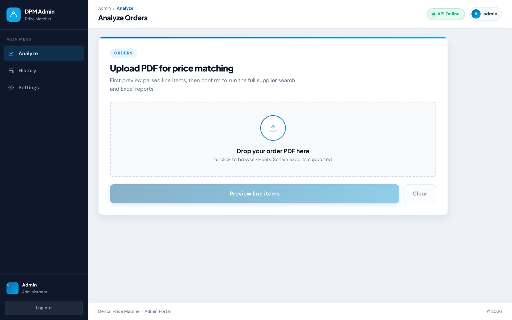
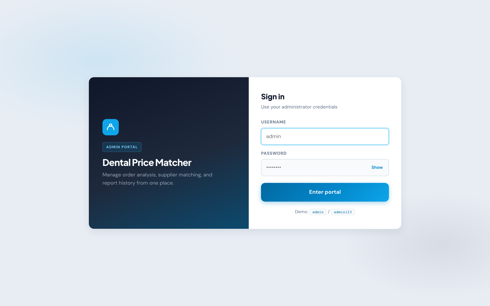
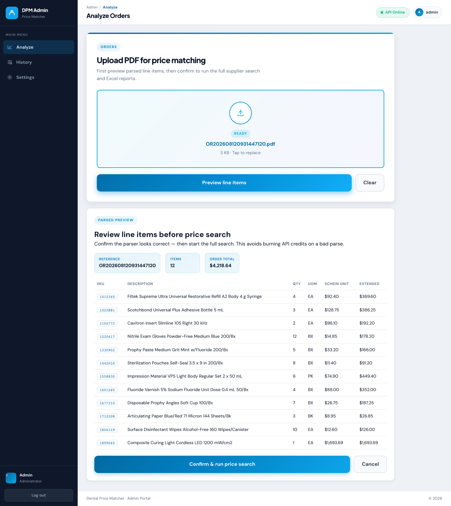
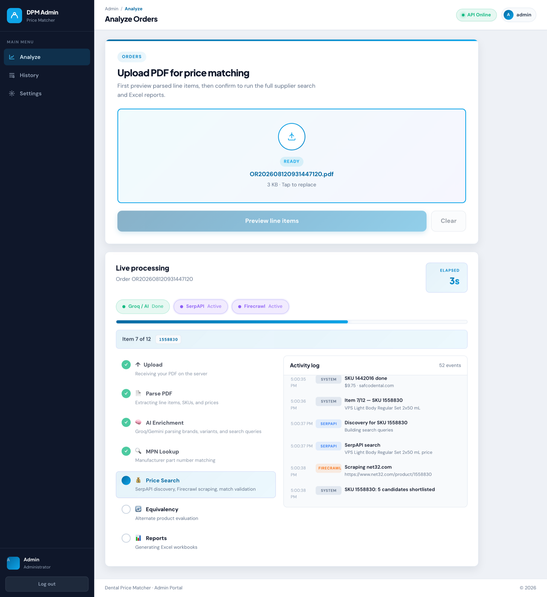
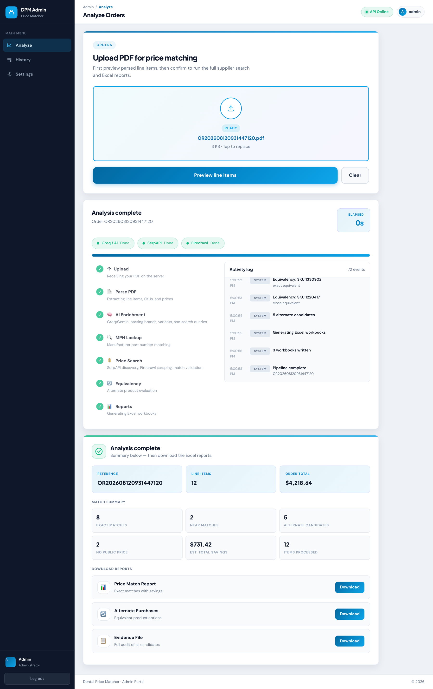
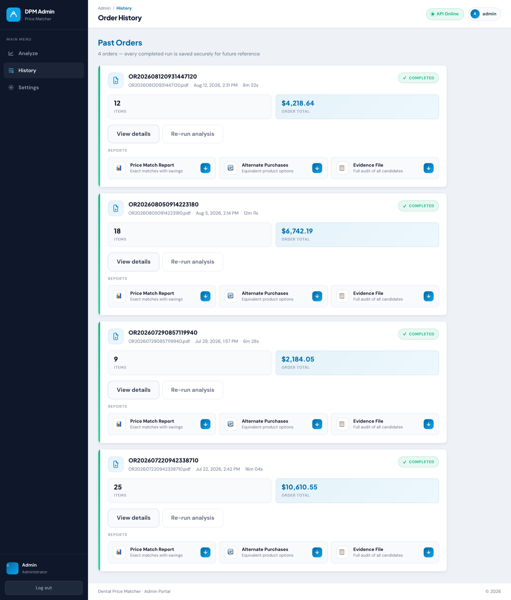
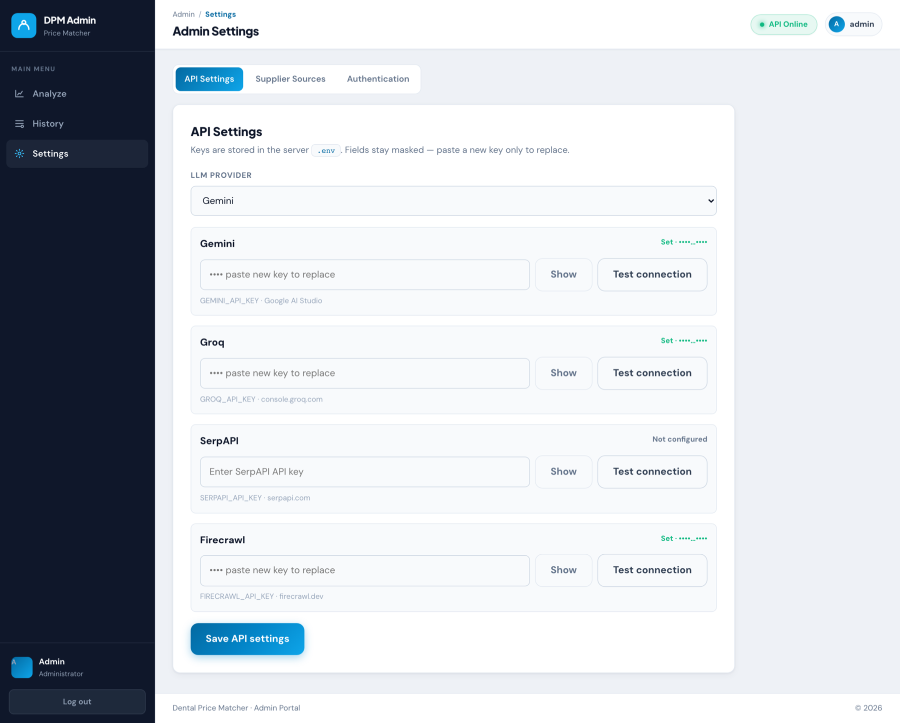

<div align="center">

# 🦷 Dental Price IQ

**Turn a weekly dental supply order into a ranked list of cheaper places to buy it.**

Upload a Henry Schein order PDF → the pipeline parses every line item, sweeps the public web for
the same product, verifies each candidate page, and returns three Excel workbooks showing exactly
where the practice is overpaying.

<sub>

`FastAPI` · `React 19` · `TypeScript` · `Vite` · `SQLite` · `Groq / Gemini` · `SerpAPI` · `Firecrawl`

</sub>



</div>

---

## What it does

A dental practice orders the same ~20 consumables every week from a single distributor. Nobody has
time to price-check 20 SKUs across a dozen suppliers by hand, so the practice quietly overpays.

Dental Price IQ automates that check end to end:

| | |
|---|---|
| 📄 **Parses the order PDF** | Token state-machine over PyMuPDF output. Every row must satisfy `qty × unit ≈ extended`, so column misalignment can't produce phantom line items. |
| 🧠 **Enriches each line with AI** | Groq or Gemini extracts brand, variant, size/form, pack quantity, and MPN from the free-text description. |
| 🔎 **Sweeps the public web** | SerpAPI Google Shopping + organic backfill. No hardcoded supplier list — any legitimate seller can surface. |
| 🌐 **Verifies every candidate page** | Firecrawl renders the page with JS and extracts price, pack size, variant, and login-wall status. Page content always beats the search-result title. |
| ✅ **Applies four trust criteria** | Brand **and** product name **and** size/form **and** pack quantity must all match before anything is called an exact match. |
| 🔄 **Evaluates equivalents** | A client-editable equivalency table drives the "close enough" stream, kept strictly separate from exact matches. |
| 📊 **Writes three Excel reports** | Price matches, alternate purchases, and a full evidence audit — with product URLs in all three. |

### The three outputs

| File | Contents |
|---|---|
| `*_price_match.xlsx` | Exact matches only, sorted by total savings descending |
| `*_alternate_purchases.xlsx` | Exact and close equivalents, driven by the equivalency table |
| `*_evidence.xlsx` | Every URL, price, condition, and rejection reason + a parsed-order audit |

---

## Screenshots

### Sign in

A single admin portal in front of the pipeline.



### Parse preview — check before you spend

The parser runs first and shows you every extracted line item. Nothing hits a paid API until you
confirm the parse looks right, so a bad PDF never burns SerpAPI or Firecrawl credits.



### Live processing

Server-sent events stream the whole run: pipeline stage, per-item progress, live service status for
Groq / SerpAPI / Firecrawl, and a timestamped activity log of every search and scrape.



### Results

Match summary, estimated savings, and one-click downloads for all three workbooks.



### Order history

Every completed run is persisted to SQLite and its reports stay downloadable.



### Admin settings

Rotate API keys, switch LLM provider, and manage supplier sources without touching the code.



<sub>Screenshots use demo order data — no real practice or patient information is shown, and API keys are masked.</sub>

---

## Quick start

### Prerequisites

- Python 3.10+ (the codebase uses `X | None` annotations; 3.12 is what Docker and Render use)
- Node 18+
- API keys: [Groq](https://console.groq.com) or [Gemini](https://aistudio.google.com),
  [SerpAPI](https://serpapi.com), [Firecrawl](https://firecrawl.dev)

### 1. Backend

```bash
python3 -m venv .venv && source .venv/bin/activate
pip install -r requirements.txt
cp .env.example .env    # then fill in your keys
uvicorn app.main:app --port 8000
```

### 2. Frontend

```bash
npm --prefix frontend install
npm --prefix frontend run dev
```

Open **http://localhost:5500**. Vite proxies `/api` to the backend on port 8000, so no extra config
is needed for local development.

Default demo credentials are `admin` / `admin123` — override them with `VITE_LOGIN_USER` and
`VITE_LOGIN_PASS`, or change them in the Authentication tab of Settings.

### 3. Or run it from the CLI

```bash
# Full run against one order
python -m app.main path/to/order.pdf

# Parse + reports only — no API spend, used for parser validation
python -m app.main path/to/order.pdf --skip-search
```

---

## Configuration

### Environment variables

| Variable | Purpose |
|---|---|
| `GROQ_API_KEY` | Groq inference (free tier is enough for a weekly run) |
| `GEMINI_API_KEY` | Gemini, when `LLM_PROVIDER=gemini` |
| `SERPAPI_API_KEY` | Google Shopping + organic search |
| `FIRECRAWL_API_KEY` | JS-rendered page verification |
| `LLM_PROVIDER` | `groq` \| `gemini` \| `openai` \| `openrouter` |
| `GROQ_MODEL` / `GROQ_MIN_INTERVAL` | Model choice and free-tier request pacing |
| `OUTPUT_DIR` / `DENTAL_DB_PATH` | Data locations (e.g. a Render persistent disk) |
| `ALLOWED_ORIGIN` | CORS origin for the deployed frontend |

Keys can also be pasted and rotated from the **Settings → API Settings** tab, which writes them
back to the server's `.env`.

### Client-editable config — no code changes required

| File | Purpose |
|---|---|
| `config/excluded_domains.txt` | Domains that can never be a match (the incumbent distributor, eBay, marketplaces) |
| `config/equivalency_table.txt` | `SKU \| equivalent name \| brand \| note` — drives the alternate-purchase stream |
| `config/supplier_sources.json` | Supplier source list and priorities, editable from the Settings UI |
| `config/mpn_table.txt` | Known manufacturer part numbers |

---

## How matching works

The expensive part of price matching isn't finding candidate pages — it's rejecting the wrong ones.
A 50-pack listed at a great price is not a match for a 100-pack, and a search-result title routinely
lies about shade or pack size.

**Four trust criteria.** Brand, product name, size/form, and pack quantity must *all* match.
Deterministic pre-checks (price sanity, volume normalization, exact pack equality) run before the
model is consulted, so obvious mismatches never cost a token.

**Hard filtering rules:**

- Excluded domains and all their subdomains are dropped
- `.pdf` and other document links are dropped
- Category, taxonomy, and search URLs (`/category/`, `/collections/`, `/search`, `?q=`, bare roots)
  can never become a product match
- Scraped page content is authoritative over search-result titles — a shade or pack mismatch between
  the title and the page demotes the candidate
- Pack-mismatched candidates never reach the primary report no matter how cheap they are; they
  appear in the evidence file with the condition stated explicitly
- Login-walled pricing is rejected and listed on the Flagged Sites sheet

---

## Architecture

| Layer | File | Notes |
|---|---|---|
| Intake / parsing | [`app/parser.py`](app/parser.py) | PyMuPDF token state machine; OCR fallback hook (Tesseract) for scanned PDFs |
| AI reasoning | [`app/ai.py`](app/ai.py) | Batched description parsing, 4-criteria match validation, equivalency scoring. Built-in request pacing (~28 req/min) and backoff for free-tier limits |
| Market sweep | [`app/search.py`](app/search.py) | SerpAPI `google_shopping` + organic backfill — whole-web, no supplier list |
| Page verification | [`app/search.py`](app/search.py) | Firecrawl v2 JS-rendered scrape with a JSON schema (price, pack, variant, login-wall detection) |
| Exact matching | [`app/matcher.py`](app/matcher.py) | Deterministic pre-checks + AI validation |
| Equivalency | [`app/matcher.py`](app/matcher.py) | Driven only by the equivalency table; stream separation enforced |
| Reports | [`app/reports.py`](app/reports.py) | openpyxl workbook generation |
| Jobs / SSE | [`app/jobs.py`](app/jobs.py) | Background job runner and the progress event stream |
| Persistence | [`app/db.py`](app/db.py) | SQLite; schema includes tables reserved for par levels, consumption modeling, and reorder projections |
| Frontend | [`frontend/src`](frontend/src) | React 19 + TypeScript; `useJobProgress` turns the SSE stream into the live pipeline view |

```
├── app/                  FastAPI backend + pipeline
├── frontend/             React admin portal
├── config/               Client-editable tables and domain lists
├── output/               Generated Excel reports + SQLite DB
├── docs/screenshots/     README images
├── Dockerfile            Backend container
└── render.yaml           Render deployment
```

---

## Parser validation

`python validate_parser.py` runs the parser against the real sample orders and reconciles totals:

| Order | Items | Total reconciles | Phantom rows |
|---|---|---|---|
| OR202602190851373110 (02/19) | 11/11 | $2,849.58 ✓ | 0 |
| OR202602251732249700 (02/25) | 16/16 | $5,528.06 ✓ | 0 |
| OR202603121104075460 (03/12) | 12/12 | $3,951.58 ✓ | 0 |
| OR202605280844126040 (05/28) | 25/25 | $10,610.55 ✓ | 0 |

Every row passes the `qty × unit ≈ extended` guard, which makes column misalignment structurally
impossible rather than merely unlikely.

---

## Deployment

The backend ships as a container and the frontend as a static build.

```bash
# Backend
docker build -t dental-price-iq .
docker run -p 8000:8000 --env-file .env dental-price-iq
```

`render.yaml` deploys the API to Render; `frontend/vercel.json` handles SPA routing on Vercel. Point
the frontend at the deployed API with `VITE_API_BASE`, and set `ALLOWED_ORIGIN` on the backend to
the frontend's origin.

---

## Cost per run

For a typical ~20-item weekly order:

| Service | Usage |
|---|---|
| SerpAPI | ~2 searches per item ≈ 40–50 searches |
| Firecrawl | ~5 page scrapes per item ≈ 100 scrapes |
| Groq | ~2 parse calls + 1 validation call per item ≈ 25 requests, paced under 30 req/min — free tier |

Discovery, scrape, and extraction results are all cached in SQLite, so re-running a similar order
costs substantially less.
